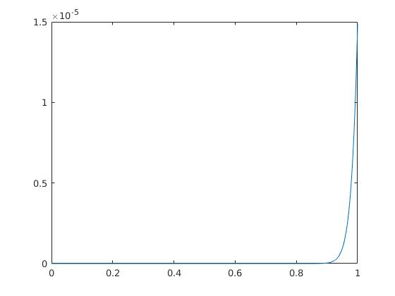
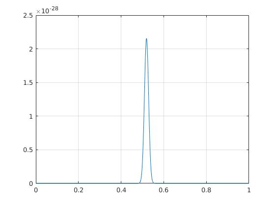

有一个投硬币问题是这样的：有一个均匀的硬币，当我们连续100次投出正面后，第101次是正面的概率大还是反面的概率大？
按照频率派的观点看，第101次投硬币和前100次独立，硬币又是均匀的，那么正反概率相同，均为\\(\frac{1}{2}\\)。

下面从贝叶斯学派的观点来解释。

<!-- more -->

用随机变量x\\(\in \lbrace 0, 1 \rbrace\\)来表示投硬币的结果，其中0代表反面，1代表正面。
显然x\\(～B(n, \theta)\\)，用斜体\\(x_i\\)表示第i次随机事件值，\\(\textbf{x}=[x_1,x_2,...,x_{100}]^T\\)表示100次随机事件值的向量。
贝叶斯公式：

$$p(\theta|\textbf{x})=\frac{P(\textbf{x}|\theta)p(\theta)}{P(\textbf{x})}$$

其中\\(p(\theta)\\)为\\(\theta\\)的先验，\\(p(\theta|\textbf{x})\\)为\\(\theta\\)的后验，\\(P(\textbf{x}|\theta)\\)为似然函数，\\(P(\textbf{x})\\)为标准化常量。

公式中概率和概率密度函数混用，大写\\(P\\)表示概率，小写\\(p\\)表示概率密度函数。

在这里\\(P(\textbf{x})\\)的意义不大，我们只关心
$$p(\theta|\textbf{x}) \propto P(\textbf{x}|\theta)p(\theta)$$

如果我们认为硬币是比较均匀的，那么我们可以给\\(\theta\\)一个正态的先验，\\(\theta～N(\frac{1}{2}, \sigma)\\)，\\(\sigma\\)越小说明我们对“均匀”的信心越大。似然函数\\(P(\textbf{x}|\theta)=\theta^{100}\\)。

因此，

$$p(\theta|\textbf{x}) \propto \theta^{100}\frac{1}{\sqrt{2\pi}\sigma}e^{-\frac{(\theta-\frac{1}{2})^2}{2\sigma^2}}$$

该函数的形状取决于\\(\sigma\\)的取值，当\\(\sigma\\)较大时，即我们的先验认为硬币可能不那么均匀的时候，它的在\\(\theta=1\\)时取得最大值，如图1；当\\(\sigma\\)较小时，即在先验非常相信硬币是均匀的情况下，它在略大于0.5处取得最大值，如图2。大于0.5意味着我们应该相信实验，第101次正面的概率会比反面大。

<!--#

!-->
$$\sigma=0.1$$
<!--#

!-->

$$\sigma=0.01$$
特别地，考虑\\(\sigma\\)趋于0的情况，即先验认为硬币绝对均匀，此时\\(p(\theta)=\delta(\theta - 0.5)\\)，此时\\(P(\textbf{x}|\theta)\\)项对\\(p(\theta|\textbf{x})\\)的取值没有影响，即\\(p(\theta|\textbf{x})=p(\theta)\\)，后验等于先验。也就是说在我们认为硬币绝对均匀时\\(\theta\\)的唯一取值为\\(\frac{1}{2}\\)，第101次实验正反的概率相同，此时贝叶斯学派的观点和概率学派是一致的。

